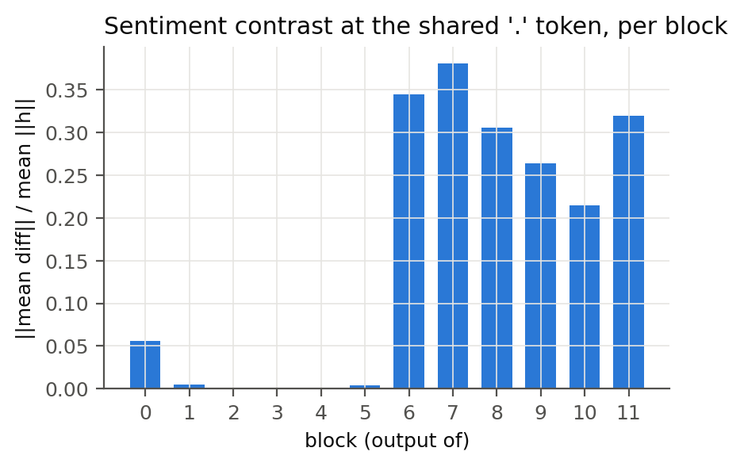
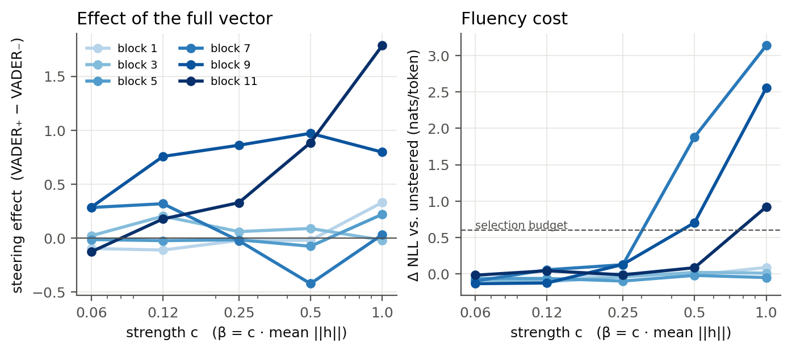
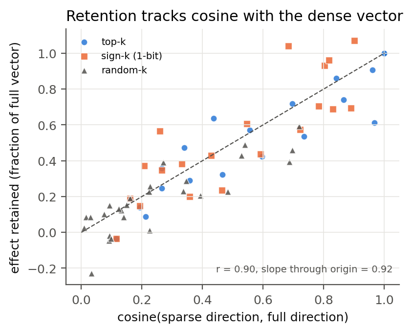
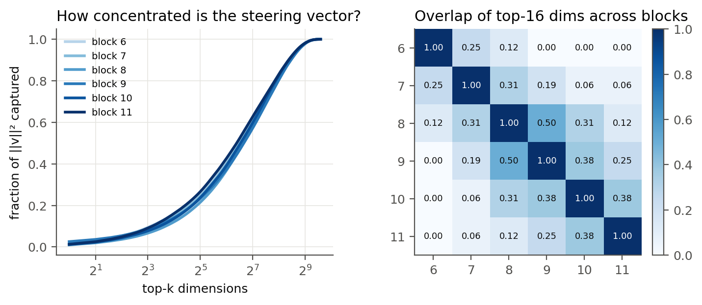

## Abstract

Activation steering adds a fixed vector to a transformer's residual stream to push generations toward a
trait. The vectors in common use are dense: one float per residual dimension. We ask how much of that is
necessary. Using the original 2018 GPT (GPT-1, 117M parameters, 768-dimensional residual stream) — a base
model that can still be fetched with one `git clone` — we extract mean-difference sentiment vectors at every
block, then sparsify them by keeping only the top-$k$ coordinates by magnitude, or only the *signs* of those
coordinates (a one-bit vector), rescaled to the original norm. We measure the steering effect as the gap in
VADER sentiment between positively and negatively steered continuations, and the fluency cost as the extra
per-token negative log-likelihood of the generated text under the unsteered model. Three things emerge. First, the effect decays smoothly, not with a cliff: at the two steerable blocks (9 and 11), keeping 96 of 768 dimensions retains 54–72% of the full effect, 12 dimensions retain 29–47%, and a single dimension retains 0–19%. Second, quantising the surviving coordinates to one bit is free: sign-$k$ vectors match top-$k$ vectors at every $k$ (a 12-dimension, one-bit vector at block 9 still moves sentiment by 0.33 VADER points at no fluency cost). Third, all of this is explained by a single number — the cosine between the sparse direction and the dense one: across 67 sparse variants (top-$k$, sign-$k$, random-$k$) the retained effect equals that cosine with $r=0.90$ and unit slope. Sparse steering therefore works exactly as well as linear response predicts, no better and no worse, and its limit is set by how concentrated the dense vector is (top-96 dimensions hold half of its energy in GPT-1). Random supports of the same size retain about half as much, and the strongest coordinates are the model's high-variance "rogue" residual channels.
Along the way we find that in GPT-1 the sentiment of a short sentence becomes linearly readable at the
sentence-final period only from block 6 onward: at blocks 0–5 the contrast between positive and negative
contexts at that token is two orders of magnitude smaller than at block 6. We release the per-block vectors
(76 KB), a loader that turns OpenAI's original NumPy shards into a Hugging Face model, a faithful port of the
original tokenizer, and every generation from the sweep.

## 1. Introduction

Steering vectors — adding $\beta\,\mathbf{u}$ to the residual stream at one layer — are one of the cheapest
ways to change what a language model does without changing its weights. Contrastive Activation Addition
(Rimsky et al., 2023), ActAdd (Turner et al., 2023) and Inference-Time Intervention (Li et al., 2023) all
build such vectors from differences of activations, and all treat the vector as a dense object living in the
full residual space.

That density is convenient but unexamined. If most of a steering vector's effect comes from a handful of
coordinates, three things follow. Storing and shipping a steering "behaviour" becomes almost free (a
one-bit, 12-dimensional vector is a dozen indices and a dozen signs). The vector becomes *nameable*: it
points at specific residual channels one can go and look at. And the outlier-dimension literature — rogue
dimensions (Timkey & van Schijndel, 2021), massive activations (Sun et al., 2024) — raises a concrete worry:
maybe sparse steering "works" only because it lands on the few high-variance channels that dominate the
residual norm anyway.

We study this on the smallest interesting base model we could obtain in a locked-down environment: the
original GPT (Radford et al., 2018). Its weights sit as plain NumPy shards in OpenAI's 2018 GitHub
repository, so the whole study needs no model hub, no GPU and no account. GPT-1 also has a property that
makes strength calibration unusually clean: it is a *post-LayerNorm* transformer, so the residual stream
between blocks is re-normalised at every block and "$\beta$ relative to the residual norm" means the same
thing at every depth.

**Contributions.** (i) A loader that rebuilds GPT-1 into a Hugging Face `OpenAIGPTLMHeadModel` from the
original shards without the lost `parameters_names.json`, plus a port of the original ftfy+spaCy+BPE
tokenizer. (ii) Per-block sentiment steering vectors for GPT-1, released as safetensors. (iii) A
layer × strength × sparsity sweep with random-support controls, showing that a sparse steering vector retains exactly the fraction of the full effect that its cosine with the dense vector predicts ($r=0.90$, slope 0.92), that one-bit quantisation of the kept coordinates costs nothing, and that the strongest coordinates coincide with the model's highest-variance residual channels.
(iv) A small observation about *where* sentiment lives in GPT-1: the sentence-final period does not carry a
linearly readable sentiment contrast until block 6, after which it carries a large one.

## 2. Setup

**Model.** GPT-1: 12 post-LN blocks, $d=768$, 12 heads, 40,478 BPE tokens, 512 positions. We reconstruct
the weights from `params_{0..9}.npy` + `params_shapes.json` by walking the parameter order of the
original TensorFlow graph (positional embeddings, token embeddings, then per block: `c_attn`, `c_proj`,
`ln_1`, `c_fc`, `c_proj`, `ln_2`). The reconstruction is verified by perplexity on plain English and by
greedy continuations (e.g. *"the united states of america is a country in north"* → *"america ."*).
Because GPT-1 is post-LN with no final LayerNorm, the output of block 11 feeds the unembedding directly;
steering at block 11 is therefore equivalent to a fixed logit bias $\beta\,\mathbf{u}W_E^\top$, whereas
steering at earlier blocks is genuine activation steering that must pass through later attention and MLPs.
We report both.

**Extraction.** 20 neutral contexts (*"the movie was"*, *"the hotel room was"*, …) × 10 positive/negative
adjective pairs (*wonderful/terrible*, *excellent/awful*, …) give 200 contrastive pairs. Each sentence is
terminated with a period and we read the residual stream **at the period**, so the mean difference
$\mathbf{v}_L = \overline{h_L^{+}} - \overline{h_L^{-}}$ encodes the sentiment *context* rather than the
identity of the adjective token (in a first attempt without the shared read-out token, the vector was
dominated by token identity and destroyed fluency at $\beta$ as small as a quarter of the residual norm).

**Steering.** A forward hook adds $\beta\,\mathbf{u}$ to the output of block $L$ at every position, with
$\mathbf{u}=\mathbf{v}_L/\|\mathbf{v}_L\|$ and $\beta = c\cdot\overline{\|h_L\|}$, the mean residual
norm at that block measured on the extraction set. We sweep $L\in\{1,3,5,7,9,11\}$ and
$c\in\{0.06, 0.12, 0.25, 0.5, 1.0\}$.

**Sparsification (norm-matched).** From $\mathbf{v}_L$ we build three families of unit vectors with
exactly $k$ non-zeros: **top-$k$** keeps the $k$ largest-magnitude coordinates and their values;
**sign-$k$** keeps only their signs ($\pm 1$), i.e. a one-bit vector on a $k$-sparse support;
**random-$k$** keeps the values of $\mathbf{v}_L$ on a uniformly random support (three supports per $k$).
All are rescaled to unit norm before multiplying by $\beta$, so every condition injects the same energy.
$k \in \{768, 384, 192, 96, 48, 24, 12, 6, 3, 1\}$.

**Evaluation.** 24 neutral prompts disjoint from the extraction contexts (*"the interview went"*,
*"the package arrived and"*, …). For each condition we sample 24 tokens per prompt (nucleus $p=0.9$,
temperature 0.8, fixed seeds shared across conditions). The **steering effect** is
$\mathrm{VADER}(+\beta\mathbf{u}) - \mathrm{VADER}(-\beta\mathbf{u})$, the difference in mean compound
sentiment (Hutto & Gilbert, 2014; range $[-2, 2]$) between the positively and negatively steered runs;
using the *difference* cancels prompt-level sentiment and evaluator bias. The **fluency cost** is the mean
per-token NLL of the generated continuation under the unsteered model, averaged over the two directions,
minus the unsteered baseline. Stage A (layer × strength) uses one sampling seed per condition; the
sparsity sweep at the primary block uses two seeds (48 generations per direction), and random-$k$ controls
use one seed per support.

## 3. Results

### 3.1 Where sentiment lives in GPT-1

{width=62%}

Figure 1 shows the size of the sentiment contrast at the shared period token after each block, relative to the residual norm there. Blocks 1–5 carry a contrast of 0.05–0.5% of the residual norm (the embedding layer itself, block 0, carries 5.6%, which is just the adjective's own embedding leaking through the shared period) — every one of the 200 pairs still projects positively on the mean direction, so the signal is consistent, but it is tiny. At block 6 it jumps to 34% and stays between 21% and 38% through block 11. In GPT-1 the "copy the sentiment of the clause into the punctuation token" operation is a mid-network event, and any steering vector extracted at the period before block 6 is, for practical purposes, a random direction. This is visible in the strength sweep: blocks 1, 3 and 5 do nothing until $c=1$.

### 3.2 Layer × strength

Only the late blocks steer (Figure 2). Block 9 reaches an effect of 0.86 at $c=0.25$ for +0.13 nats/token, and 0.97 at $c=0.5$ for +0.7 nats; block 11 — the logit-bias case — reaches 0.89 at $c=0.5$ for +0.09 nats and 1.79 at $c=1$ for +0.9 nats. Block 7 is the fragile one: at $c=0.5$ it collapses into gibberish (+1.9 nats) with a *negative* measured effect, presumably because the vector at block 7 still has a large token-identity component that later blocks amplify. We take block 11 at $c=0.5$ (the largest effect within a +0.6 nat budget) as the primary block for the sparsity sweep and block 9 at $c=0.25$ as the second, more interesting one, since its vector must propagate through two more blocks before reaching the output. Unsteered, the 24 prompts have a mean VADER of +0.10 and 2.01 nats/token.

### 3.3 Sparsity

Figure 3 is the main result. Reading it right to left (from dense to sparse):

*The effect decays gradually.* There is no $k$ below which steering suddenly stops working, and none above which it saturates early. At block 9, top-$k$ retains 91% of the full effect at $k=384$, 86% at 192, 72% at 96, 57% at 48, 47% at 12 and 19% at $k=1$; block 11 gives 61/74/54/42/29/–4% for the same $k$. Halving $k$ costs roughly a tenth of the effect.

*One bit per coordinate is enough.* Sign-$k$ tracks top-$k$ at every $k$ at both blocks; where the two differ the difference is within the bootstrap standard error (≈ 0.08–0.11 in effect units). At block 9 a sign-96 vector (96 indices and 96 signs, about 130 bytes) gives an effect of 0.90 versus 0.86 for the full 768-float vector. The one exception is the full-support one-bit vector at block 11 (0.71 vs 1.00): with every coordinate kept, the magnitudes do carry information, and at the output layer that information is not laundered through any further computation.

*The support matters, about two-fold.* A random support of the same size retains about half of what the top-magnitude support retains (block 11, $k=96$: 0.24 vs 0.54; $k=192$: 0.38 vs 0.74; $k=384$: 0.48 vs 0.61). But random supports are far from useless — 96 random coordinates of the sentiment vector still steer more than a quarter as well as all 768 — which says the vector is diffuse, not that its top coordinates are special.

*Fluency is untouched.* No sparse condition costs more than 0.22 nats/token, and most cost under 0.1. Sparsifying does not create the gibberish failure mode of over-strong dense steering.

Table 1 gives the numbers behind Figure 3.

| $k$ | 768 | 384 | 192 | 96 | 48 | 24 | 12 | 6 | 3 | 1 |
|----------------------|-----|-----|-----|-----|-----|-----|-----|-----|-----|------|
| block 9, top-$k$ | **0.86** | 0.78 | 0.74 | 0.62 | 0.49 | 0.55 | 0.41 | 0.31 | 0.08 | 0.16 |
| block 9, sign-$k$ | 0.80 | 0.92 | 0.83 | 0.90 | 0.52 | 0.37 | 0.33 | 0.49 | 0.32 | 0.16 |
| block 11, top-$k$ | **1.00** | 0.62 | 0.74 | 0.54 | 0.43 | 0.32 | 0.29 | 0.25 | 0.14 | -0.04 |
| block 11, sign-$k$ | 0.71 | 0.70 | 0.69 | 0.58 | 0.44 | 0.24 | 0.20 | 0.35 | 0.15 | -0.04 |
| block 11, random-$k$ (mean of 3) | — | 0.48 | 0.38 | 0.24 | 0.29 | 0.10 | 0.14 | 0.06 | 0.01 | -0.04 |

Table: Steering effect ($\mathrm{VADER}_+ - \mathrm{VADER}_-$) by sparsity. Block 9: $c=0.25$; block 11: $c=0.5$. Bootstrap SE ≈ 0.08 (block 11, two seeds) and ≈ 0.10 (block 9 and random-$k$, one seed).

### 3.4 Why: retention equals cosine

{width=58%}

All three families collapse onto one line when plotted against the cosine between the sparse unit vector and the dense unit vector (Figure 4): Pearson $r=0.90$ across 67 variants, and the best-fit line through the origin has slope 0.92. To first order, then, the model responds *linearly* to the component of the injected vector along the true sentiment direction and ignores the rest — an orthogonal residue of the same norm does not help and, within the strengths used here, does not hurt fluency either. This explains all three observations above at once. Top-$k$ of a vector whose top-96 coordinates hold 49–52% of its energy has cosine $\sqrt{0.5}\approx0.70$ with the full vector, so it retains about 70% of the effect. Sign-$k$ on the same support has almost the same cosine (0.68 at $k=96$), because on the tail of a heavy-tailed vector the magnitudes are nearly uniform; only on the *full* support does throwing away magnitudes cost cosine (0.78 → observed 0.70–0.93 retention). And a random support of size $k$ has expected cosine $\sqrt{k/768}$, i.e. 0.35 at $k=96$, roughly half the top-$k$ cosine at that $k$ — matching the two-fold gap. The practical rule is therefore simple: **a sparse steering vector is worth exactly its cosine with the dense one**, so the sparsity you can afford is read off the vector's energy curve (Figure 5, left), and one bit per surviving coordinate is enough.

### 3.5 Which dimensions

The sentiment vectors are concentrated relative to a flat vector but far from sparse: the top 12 coordinates hold 9–13% of the energy (a flat vector would give 1.6%), the top 96 hold ~50%, the top 384 hold ~93% (Figure 5, left). The top-16 sets drift with depth — adjacent blocks share 25–50% of them, blocks four apart share none (Figure 5, right) — so a sparse vector is block-specific, which is expected since each post-LN block re-mixes the basis.

The coordinates that survive are disproportionately the model's high-variance channels. Ranking the 768 dimensions by their residual standard deviation on the extraction set, the top-12 steering coordinates at block 7 have standard-deviation ranks 1, 2, 3, 4, 5, 6, 9, 13, 14, 17, 20, 21; at blocks 8–10 the single strongest steering coordinate (dimension 373) is also the single highest-variance channel, and dimension 373 alone accounts for the $k=1$ effect of 0.16 at block 9. The Spearman correlation between $|v_{L,i}|$ and the per-dimension standard deviation is 0.51–0.56 at blocks 6–9 and 0.40–0.42 at blocks 10–11. This is the rogue-dimension picture (Timkey & van Schijndel, 2021): a few channels dominate the residual norm, and because a mean difference is measured in raw activation units, those channels dominate the steering vector too. Whether they dominate its *effect* for a good reason (the model reads sentiment from them) or a bad one (they simply have large units) is not something the present experiment separates; a whitened extraction is the obvious next step.

## 4. Limitations

This is a one-attribute, one-model, CPU-scale study. The evaluator is a lexicon (VADER), so the effect
measures *lexical* sentiment of 24-token samples, and its per-sample variance is high: with 24 prompts and
one or two seeds, differences below roughly 0.2 in effect are within noise, and the random-$k$ bands in
Figure 3 make that visible. The strongest steerable block (11) is the last one, where steering degenerates
to a logit bias; the block-9 results are the ones that speak to activation steering proper, and they are
the less-sampled half of the sweep. Fluency is measured by the model itself, which cannot detect
repetitive-but-likely degeneration. Finally, GPT-1 is post-LN with a small vocabulary and no final norm;
whether the same sparsity curve holds in pre-LN models with massive activations is exactly the question this
setup was designed to make cheap to ask next.

## 5. Reproduction

`bash get_gpt1.sh` clones the weights; `python src/extract.py`, `python src/run_experiments.py`,
`python src/analyze.py` regenerate every number and figure in this paper on a 2-core CPU in about
90 minutes. `python src/steer.py --layer 9 --c 0.25 --kind signk --k 12 --sign -` reproduces the
one-bit example. All 5,664 generations from the sweep are in `results/raw_generations.jsonl`.

## References

- Radford, A., Narasimhan, K., Salimans, T., Sutskever, I. (2018). *Improving Language Understanding by Generative Pre-Training.* OpenAI. Code and weights: github.com/openai/finetune-transformer-lm.
- Rimsky, N., Gabrieli, N., Schulz, J., Tong, M., Hubinger, E., Turner, A. (2023). *Steering Llama 2 via Contrastive Activation Addition.* arXiv:2312.06681.
- Turner, A., Thiergart, L., Udell, D., Leech, G., Mini, U., MacDiarmid, M. (2023). *Activation Addition: Steering Language Models Without Optimization.* arXiv:2308.10248.
- Li, K., Patel, O., Viégas, F., Pfister, H., Wattenberg, M. (2023). *Inference-Time Intervention: Eliciting Truthful Answers from a Language Model.* NeurIPS.
- Hutto, C. J., Gilbert, E. (2014). *VADER: A Parsimonious Rule-based Model for Sentiment Analysis of Social Media Text.* ICWSM.
- Timkey, W., van Schijndel, M. (2021). *All Bark and No Bite: Rogue Dimensions in Transformer Language Models Obscure Representational Quality.* EMNLP.
- Sun, M., Chen, X., Kolter, J. Z., Liu, Z. (2024). *Massive Activations in Large Language Models.* arXiv:2402.17762.
